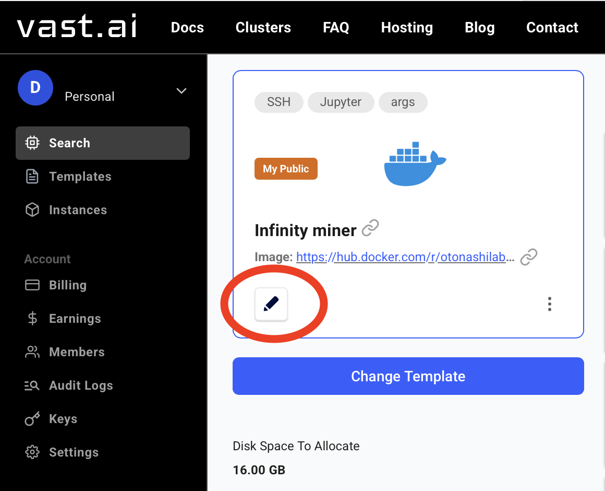
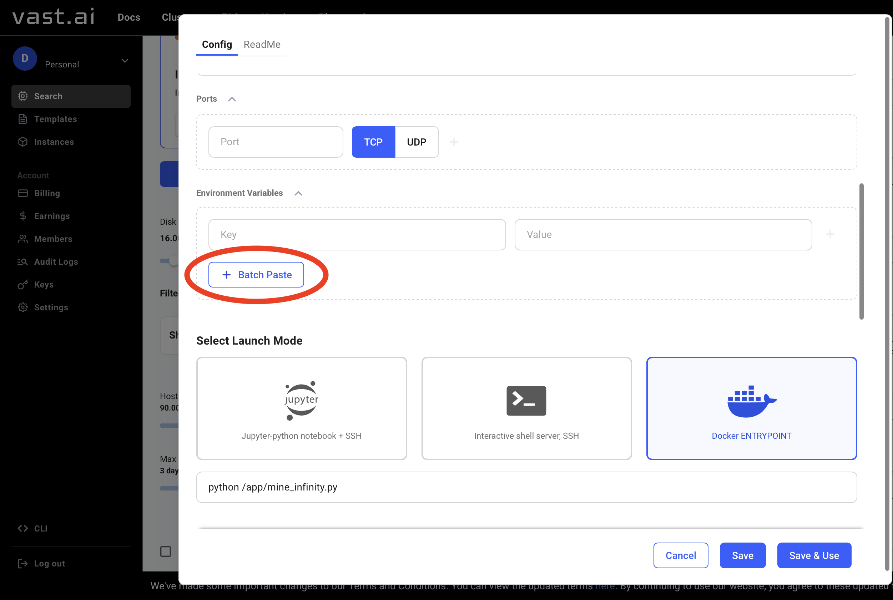
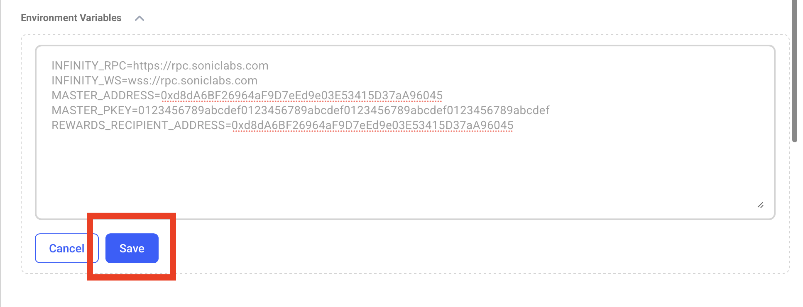
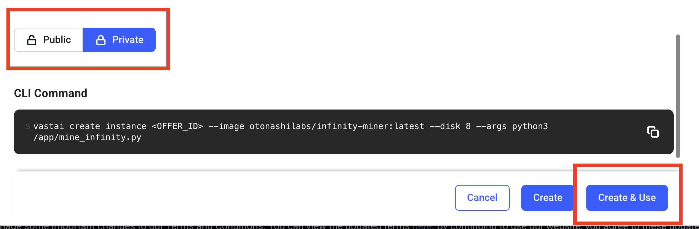
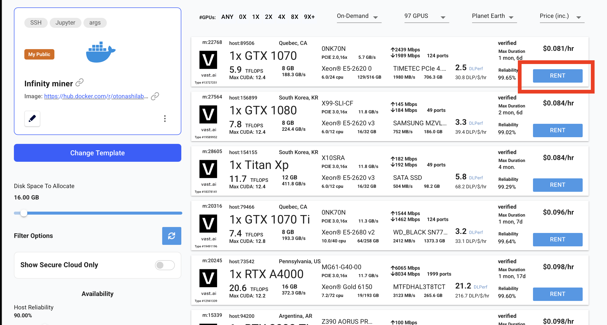

# Mining via [VAST.AI](https://cloud.vast.ai/?ref_id=164977&creator_id=164977&name=Infinity-GPU)

1. Visit [vast.ai](https://cloud.vast.ai/?ref_id=164977&creator_id=164977&name=Infinity-GPU) and create an account (or sign in). 
2. Open the Infinity [miner template](https://cloud.vast.ai/?ref_id=164977&creator_id=164977&name=Infinity-GPU).
3. Edit environment variables (click ✏️ icon).

4. Scroll down to Environment Variables, then click "Batch Paste".

5. Paste your configuration. **🚨 Remember, you should have enough $S balance to start mining! 🚨**
```
# You can get your own private node or leave these values 
INFINITY_RPC=https://rpc.soniclabs.com
INFINITY_WS=wss://rpc.soniclabs.com

# Address of your miner. It should have some $S for submit mining transactions. 
MASTER_ADDRESS=0xd8dA6BF26964aF9D7eEd9e03E53415D37aA96045

# Private key of your miner.
MASTER_PKEY=0123456789abcdef0123456789abcdef0123456789abcdef0123456789abcdef

# Address of reward recipient. You can use your miner address or different. Ensure, that you have access to it! 
REWARDS_RECIPIENT_ADDRESS=0xd8dA6BF26964aF9D7eEd9e03E53415D37aA96045
```
6. Click "Save" at the bottom of the page.


7. Scroll down, **🚨 change template mode to "Private" 🚨** and click "Create & Use". 


8. Choose a GPU setup in the marketplace and then click "Rent" on the machine you prefer. The more expensive it is, the more powerful it usually is.


9. ✅ Congratulations! Once your instance is up, the INFINITY miner will start automatically using the values you provided. Happy mining!
